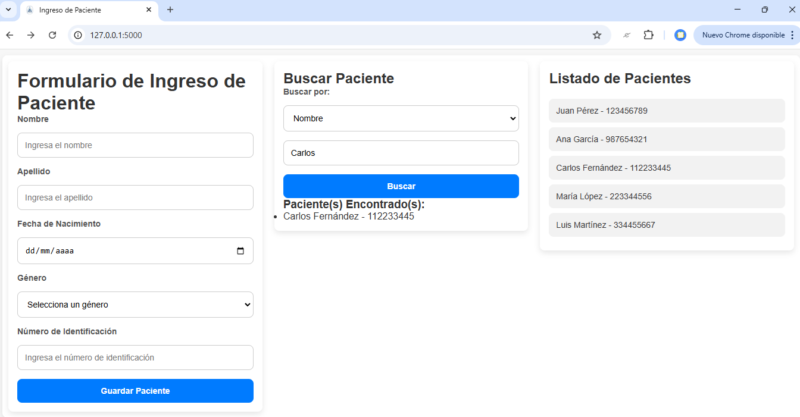

<p align="center">
  
</p>

# Proyecto de Gestión de Pacientes con Flask

Este es un proyecto para gestionar pacientes utilizando el framework **Flask** en Python. Permite registrar pacientes, buscar por ID, nombre o cédula, listar pacientes y manejar un error 404 en caso de URL no encontrada.


---

## Descripción de Funcionalidades

El proyecto cuenta con las siguientes funcionalidades:

- **Registro de pacientes**: Permite registrar un nuevo paciente con su nombre, apellido, fecha de nacimiento, género y número de identificación.
- **Listado de pacientes**: Muestra una lista de todos los pacientes registrados.
- **Búsqueda de pacientes**: Permite buscar pacientes por **ID**, **nombre** o **cédula**.
- **Error 404**: Si el usuario intenta acceder a una página no existente, verá una página de error 404 personalizada.
- **Interfaz de usuario sencilla**: El frontend permite interactuar de manera fácil con los formularios para registrar y buscar pacientes.

---

## Requisitos

Antes de comenzar, asegúrate de tener lo siguiente instalado en tu sistema:

- **Python 3.7 o superior**
- **Pip** (para instalar dependencias)

---

## Instrucciones de Instalación

Sigue estos pasos para instalar el proyecto en tu máquina local:

### 1. Clona el repositorio

Primero, clona el repositorio a tu máquina local:

`` git clone https://github.com/tu-usuario/gestion-pacientes-flask.git ``

### 2. Navega al directorio del proyecto

En la terminal, navega al directorio del proyecto:

`` cd gestion-pacientes-flask ``

### 3. Crea un entorno virtual

Para evitar conflictos con otras dependencias, crea un entorno virtual:

`` python -m venv venv ``

### 4. Activa el entorno virtual

`` venv\Scripts\activate ``

### 5. Instala los requerimientos

Con el entorno virtual activado, instala las dependencias necesarias desde el archivo requirements.txt:

`` pip install -r requirements.txt ``

Este comando instalará todas las dependencias necesarias para ejecutar el proyecto, como Flask y otras bibliotecas necesarias.

---

## Instrucciones de Ejecución

Una vez instaladas las dependencias, puedes ejecutar la aplicación localmente

### 1. Inicia el servidor Flask

Para ejecutar la aplicación, usa el siguiente comando:

`` python app.py ``

### 2. Abre la aplicación en tu navegador

Accede a la siguiente URL en tu navegador para interactuar con la aplicación:

`` http://127.0.0.1:5000/ ``

---

## Rutas de la API

Este módulo define varias rutas para gestionar pacientes utilizando Flask. A continuación se describen cada una de las rutas disponibles:

### `GET /`
- **Descripción**: Muestra la página principal (`index.html`).
- **Respuesta**: HTML

---

### `GET /pacientes`
- **Descripción**: Obtiene todos los pacientes registrados.
- **Respuesta**: JSON con la lista de pacientes.

---

### `GET /pacientes/<int:id>`
- **Descripción**: Obtiene la información de un paciente específico según su ID.
- **Parámetros**:
  - `id` (int): ID del paciente.
  - `nombre` (opcional): Parte del nombre del paciente.
  - `cedula` (opcional): Número de identificación del paciente.
- **Respuesta**:
  - JSON con los pacientes encontrados.
  - Código 404 si no se encuentran coincidencias.
  - Código 400 si no se especifica ningún criterio.
- **Respuesta**: JSON con los datos del paciente o mensaje de error si no se encuentra.

---

### `POST /pacientes`
- **Descripción**: Guarda un nuevo paciente.
- **Body (JSON)**:
  ```json
  {
    "nombre": "Juan",
    "apellido": "Pérez",
    "fecha_nacimiento": "1990-01-01",
    "genero": "Masculino",
    "numero_identificacion": "123456789"
  }
- **Respuesta**:
  - Código 201 si se guarda correctamente.
  - JSON con mensaje y datos del nuevo paciente.

### `Manejador de Errores`
`404 Not Found`

